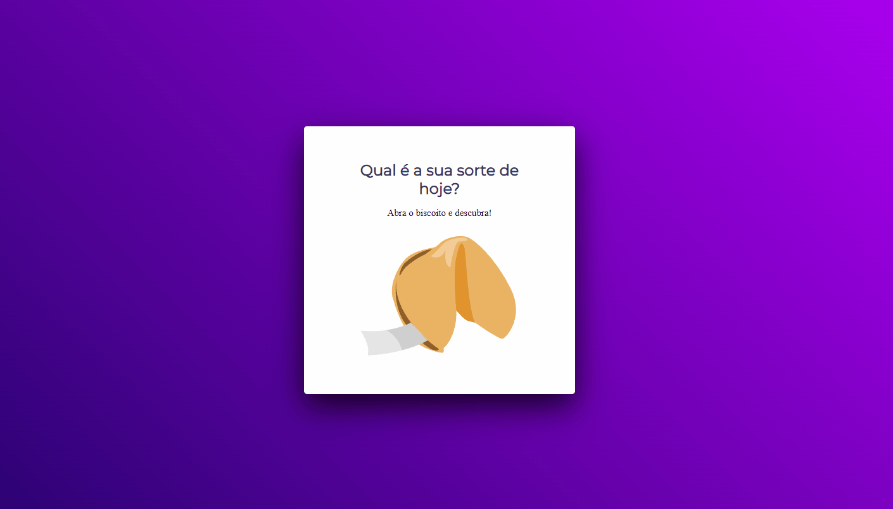

<h1 align="center"> Desafio Biscoito da Sorte </h1>

Um gerador de biscoito da sorte é o desafio do Stage 05 do curso Explore - RocketSeat 

  <a href="#-tecnologias">Tecnologias</a>&nbsp;&nbsp;&nbsp;|&nbsp;&nbsp;&nbsp;
  <a href="#-projeto">Projeto</a>&nbsp;&nbsp;&nbsp;|&nbsp;&nbsp;&nbsp;
  <a href="#-layout">Layout</a>&nbsp;&nbsp;&nbsp;|&nbsp;&nbsp;&nbsp;
  <a href="#-collaborators">Colaboradores</a>&nbsp;&nbsp;&nbsp;|&nbsp;&nbsp;&nbsp;

 

  

## 🚀 Tecnologias

Esse projeto foi desenvolvido com as seguintes tecnologias:

- HTML
- CSS
- JavaScript
- Git e Github
- Figma

## 💻 Projeto

O projeto _Biscoito da Sorte_ foi realizado como parte do curso de desenvolvimento de software da <a href="https://www.rocketseat.com.br/" alt="Link para o site da RocketSeat" target="_blank">RocketSeat</a>.

<h1 align="center">
  Funcionalidades
</h1>

O desafio foi a criação de um gerador de biscoito da sorte utilizando o layout proposto em aula e com os conhecimentos adquiridos durante a aulas do Stage 05.

### Gerador de frase

A aplicação tem como propósito gerar 30 frases motivacionais de forma aleatória quando se clica em abrir o biscoito, podendo repetir esse ciclo várias vezes.

_<h2 align="center" ><a href="https://rickazuo.github.io/biscoito-da-sorte-explorer/" target="_blank">Visite o projeto online</a></h2>_

## 📃 Colaboradores

This challenge was made by [Ricardo](https://rickazuo.github.io/portfolio/).
